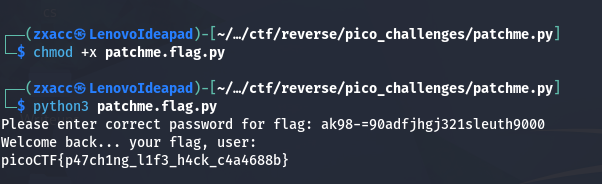
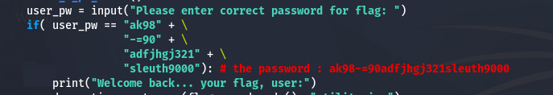

# Patchme.py

**Platform:** picoCTF 
**Category:** Reverse Engineering 
**Difficulty:** Medium 
**Points:** 100 
**Date:** 2026-07-05 

---

## 📝 Description

> A basic reverse engineering challenge that you can solve  easily only by reading the program's source code without understanding the logic 

---

## 🔍 What I Understood

There are some programs  that can be exploited easily because of some programming mistakes , like this programme where the user input is compared to the password which is in plain text and visible  to anyone who has the programme source code
 

---

## 🧠 My Approach

I opened the source code to read it in order to understand the logic , and i found that the program compares the user's input to the password directly , so i extracted the password string from the source code , then i ran the program and entered it as input , and immediately got the flag 
the vulnerable lines :
```python
user_pw = input("Please enter correct password for flag: ")
if(user_pw == "ak98" + \
              "-=90" + \
              "adfjhgj321" + \
              "sleuth9000"):
```

** Extracted Password **
```
 "ak98-=90adfjhgj321sleuth9000"
```




```bash
# commands used
chmod +x patchme.py
python3 patchme.py
nano patchme.py
```

---

## 🚩 Flag

```
picoCTF{p47ch1ng_l1f3_h4ck_c4a4688b}
```
## What I Learned 
this simulates hardcoded credentials in production code, a common real CWE — CWE-798


