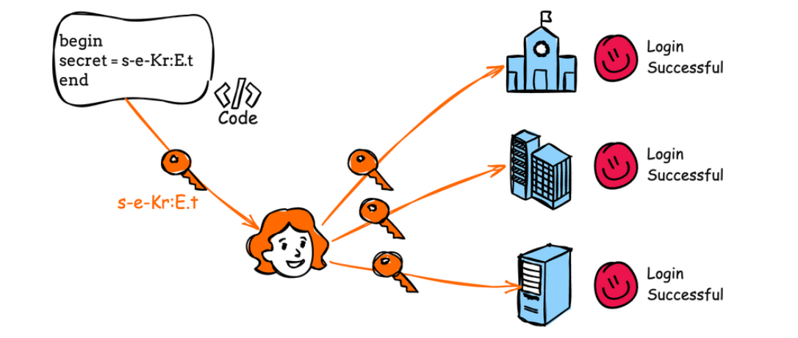

# CWE-798: Use of Hard-coded Credentials

## Definition
The software contains hard-coded credentials, such as a password or 
cryptographic key, which it uses for its own inbound authentication, 
outbound communication, or encryption of internal data.

## Why it matters
Anyone with access to the source code (or a decompiled binary) can 
extract the credential directly — no cracking, no brute force needed.

