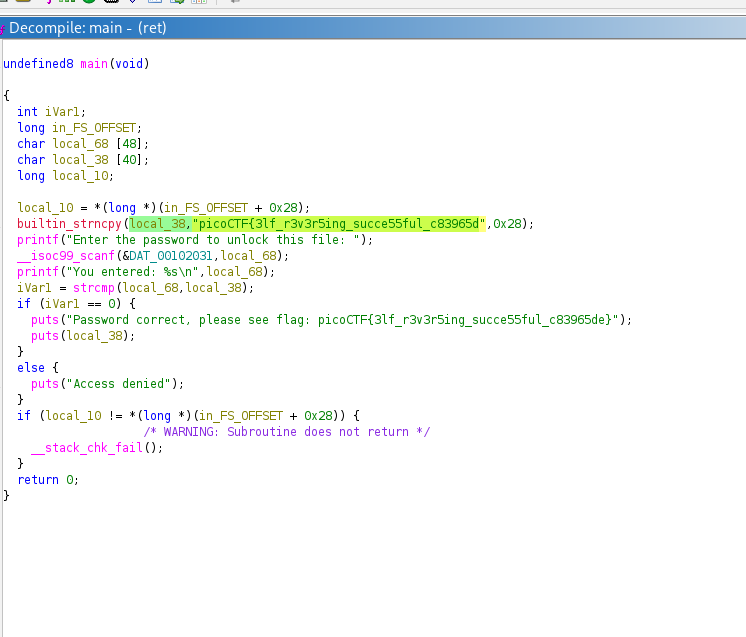
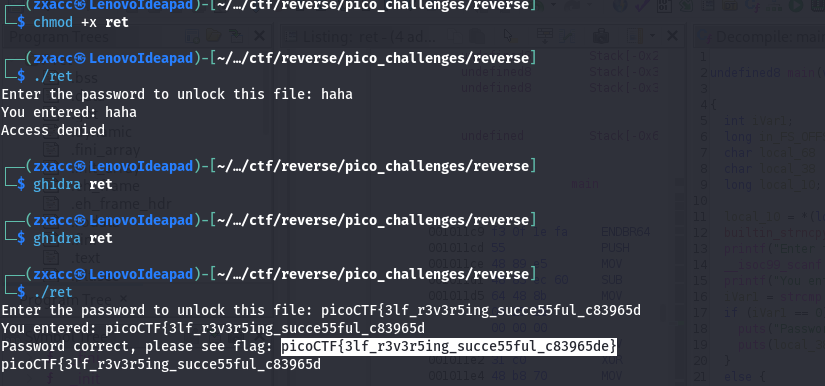

# reverse

**Platform:** picoCTF 
**Category:** Reverse Engineering 
**Difficulty:** Medium
**Points:** 100 
**Date:** 2026-07-04

---

## 📝 Description

>I Think this challenge is beginner friendly challenge that anyone can understand its solution without a big effort

---

## 🧠 My Approach

firstly i made the binary file executable and i runned it with a random password then i opened the file with ghidra , and i went directly into the main where the password is written
---

## 🛠️ Tools Used

ghidra : a static analyses tool that allow to decompile the file 

---

## ✅ Solution

when i opened the file with ghidra and i navigated into the main function ,i found the password hardcoded as a plain string in the comparaison , then i run the programme using the password and i got the flag





```bash
# commands used
chmod +x ret
./ret
```

---

## 🚩 Flag

```
picoCTF{3lf_r3v3r5ing_succe55ful_c83965de}
```

---

